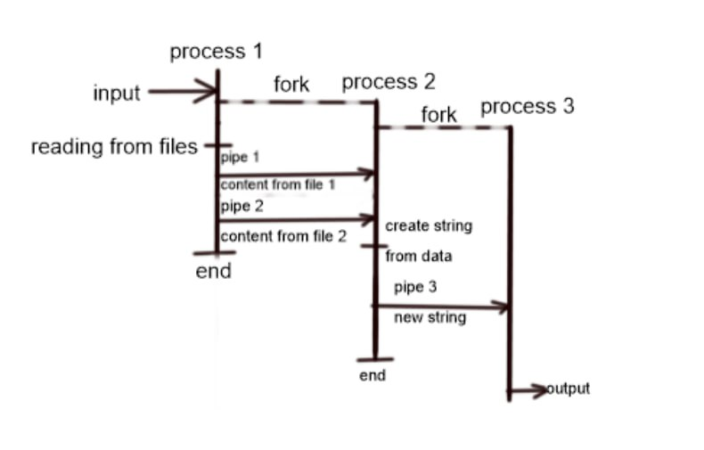
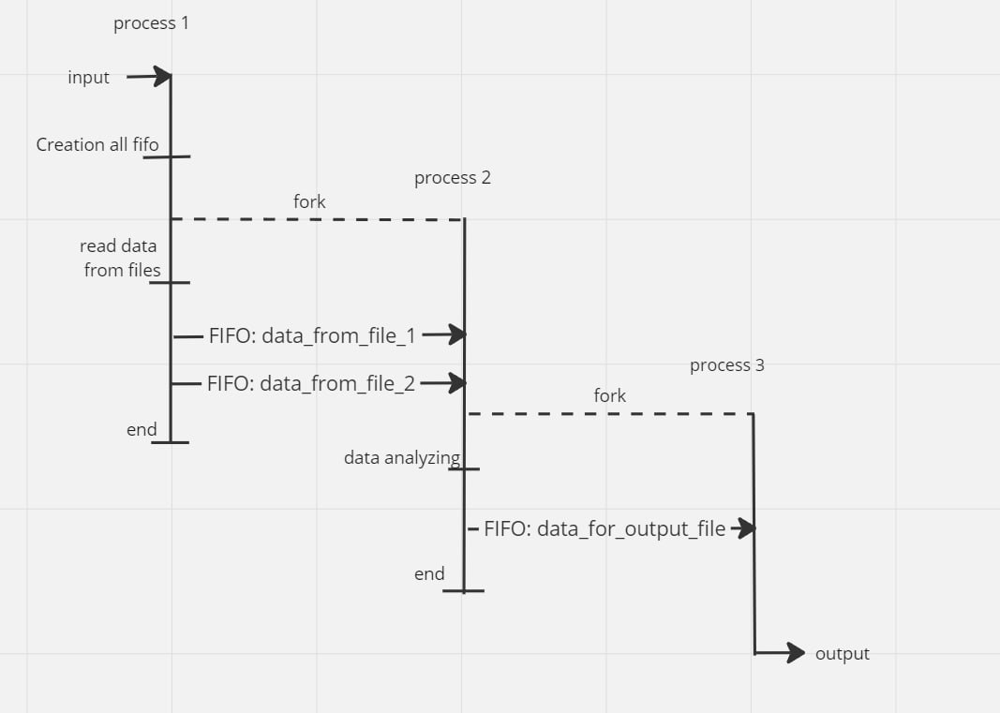
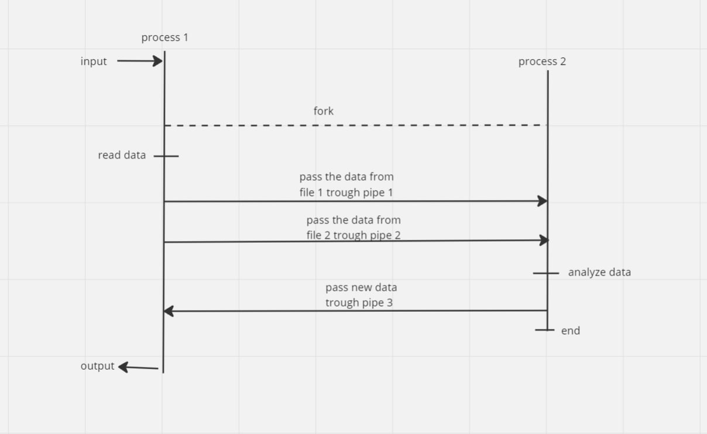

# Отчет

#### Работу выполнил Степанов Роман Андреевич, БПИ 227

#### 36 вариант, условие:

#### Разработать программу, которая на основе анализа двух ASCII– строк формирует на выходе строку, содержащую символы, присутствующие в одной или другой (объединение символов). Каждый символ в соответствующей выходной строке должен встречаться только один раз. Входными и выходными параметрами являются имена трех файлов, задающих входные и выходную строки.

Составление новой строки происходит следующим образом: 

1. Создается результирующий массив.
2. Программа проходится по первой строке и добавляет из нее только уникальные символы в том порядке, в котором они встречались в строке
3. Происходит действие аналогичное 2, но со вторым массивом
4. результат возвращается

#### Тесты общие, они лежат в папке tests. Тестовые файлы нумеруется числами. Результат работы программы на тестовых данных записывается в файл с названием i-j.txt, где i,j - числа, соответствующие тестовым файлам.

#### 4 балла: 

Схема: 

Разработанное решение лежит в папке 4. Первый процесс на запуске делает форк,  читает данные из файлов и записывает их в пайпы. Второй процесс (который был создан при помощи fork), создает свою копию (третий процесс), после чего читает данные из пайпов, составляет новую строку и записывает в третий пайп. Третий процесс читает из третьего пайпа и выводит данные в файл. 

В качестве аргументов командной строки передаются 3 параметра: `файл для чтения № 1`, `файл для чтения №2`, `файл для записи`.   

Результаты работы на тестах в папке `output`

Все pipe создаются при помощи си функции `int pipe(int* fd)`

#### 5 баллов:

Схема: 

Разработанное решение лежит в папке 5. Схема тестирования аналогична предыдущим, но взяты другие комбинации тестов. Программа использует именованные каналы (fifo) для передачи информации. Аргументы командной строки такие же, как для решения на предыдущий балл. Выходные файлы представлены в папке output. Файл i-j.txt соответствует запуску программы: `./<program name> i.txt j.txt i-j.txt`

Все именованные каналы создаются следующим образом:

1. При помощи unlink отвязываются существующие FIFO с таким именем.
2. Происходит создание FIFO при помощи функции `mkfifo(...)`

#### 6 баллов:

схема:

консольное приложение лежит в папке 6b. Аргументы командной строки как в предыдущих решениях, ввод и вывод из/в файлы сделан при помощи read/write. Результаты тестов лежат в папке  output. 

Не именованные каналы создаются при помощи функции `pipe(...)`

#### 7 баллов:

схема:

Решение лежит в папке 7b. Аргументы командной строки как в предыдущих решениях, тесты в папке output.
