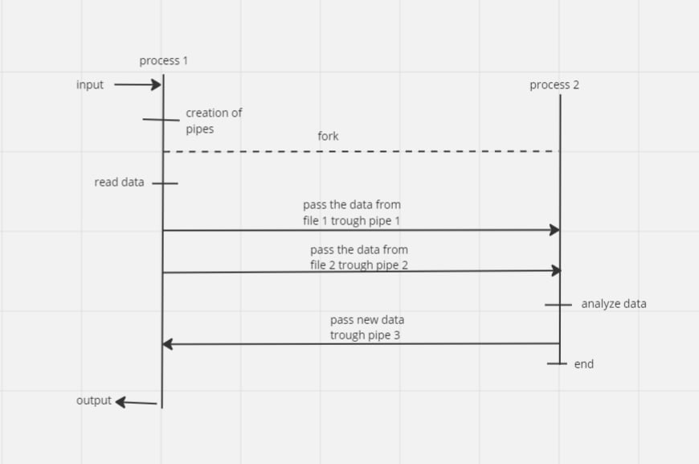
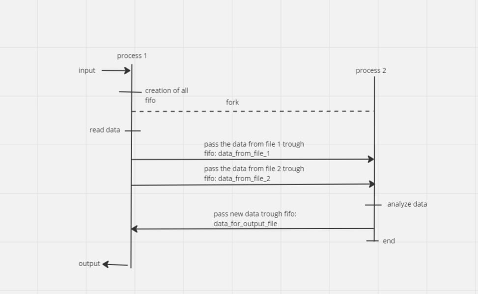

# Отчет

#### Работу выполнил Степанов Роман Андреевич, БПИ 227

#### 36 вариант, условие:

#### Разработать программу, которая на основе анализа двух ASCII– строк формирует на выходе строку, содержащую символы, присутствующие в одной или другой (объединение символов). Каждый символ в соответствующей выходной строке должен встречаться только один раз. Входными и выходными параметрами являются имена трех файлов, задающих входные и выходную строки.

Составление новой строки происходит следующим образом: 

1. Создается результирующий массив.
2. Программа проходится по первой строке и добавляет из нее только уникальные символы в том порядке, в котором они встречались в строке
3. Происходит действие аналогичное 2, но со вторым массивом
4. результат возвращается

#### Тесты общие, они лежат в папке tests. Тестовые файлы нумеруется числами. Результат работы программы на тестовых данных записывается в файл с названием i-j.txt, где i,j - числа, соответствующие тестовым файлам.

Во время работы автор пришел к выводу, что в случае 4,5,6,7 и 8 баллов для передачи содержимого двух файлов легче использовать два различных канала (в силу ограничений в 5000 байт - для простоты можно не реализовывать чтение по кускам - пока буфер не закончится, а гарантированно попытаться считать из двух различных каналов нужное количество), при этом в решениях на большую оценку помимо циклической записи/чтения в/из буфер(а), так же количество каналов для передачи содержимого файлов = 1).

В решениях на 9 и 10 баллов - данные из двух файлов передаются через один канал. 

#### 4 балла: 

Схема: 

Разработанное решение лежит в папке 4. Первый процесс на запуске делает форк,  читает данные из файлов и записывает их в пайпы. Второй процесс (который был создан при помощи fork), создает свою копию (третий процесс), после чего читает данные из пайпов, составляет новую строку и записывает в третий пайп. Третий процесс читает из третьего пайпа и выводит данные в файл. 

В качестве аргументов командной строки передаются 3 параметра: `файл для чтения № 1`, `файл для чтения №2`, `файл для записи`.   

Результаты работы на тестах в папке `output`

Все pipe создаются при помощи си функции `int pipe(int* fd)`

#### 5 баллов:

Схема: 

Разработанное решение лежит в папке 5. Схема тестирования аналогична предыдущим, но взяты другие комбинации тестов. Программа использует именованные каналы (fifo) для передачи информации. Аргументы командной строки такие же, как для решения на предыдущий балл. Выходные файлы представлены в папке output. Файл i-j.txt соответствует запуску программы: `./<program name> i.txt j.txt i-j.txt`

Все именованные каналы создаются следующим образом:

1. При помощи unlink отвязываются существующие FIFO с таким именем.
2. Происходит создание FIFO при помощи функции `mkfifo(...)`

#### 6 баллов:

схема:

консольное приложение лежит в папке 6b. Аргументы командной строки как в предыдущих решениях, ввод и вывод из/в файлы сделан при помощи read/write. Результаты тестов лежат в папке  output. 

Не именованные каналы создаются при помощи функции `pipe(...)`

#### 7 баллов:

схема:

Решение лежит в папке 7b. Аргументы командной строки как в предыдущих решениях, тесты в папке output.

#### 8 баллов:

схема:

Заметим, что схема отличается от предыдущей отсутствие форка - процессы не родственны.

Решение лежит в папке 8b. Решение разделено на 2 файла - process_1.c и process_2.c. Первый - читает из файлов и записывает в файл - второй делает анализ. В данной ситуации автор столкнулся с небольшими проблемами с mkfifo (неясными ему) и стал использовать mknod, который рассматривался презентациях. Для корректной работы - первый процесс поднимать как любое из предыдущих решений (передавая ему имена трех файлов) - второй без аргументов. Запускать можно в любом порядке.

#### 9 баллов:

схема:

То, что находится в желтых блоках - выполняется в цикле.

Размер буфера для передачи информации - 128 байт - указывается в файле lib/analysis.c: глобальная переменная small_buffer_size. Оба файла передаются через один канал. Из файлов данные читаются по 128 байт циклически, запись происходит одна - в силу того, что общий размер прочитанного становится известен. Второй процесс читает из канала так же циклически по 128 байт, делает анализ и отсылает данные обратно так же через одну запись. Первый процесс читает из канала циклически и сразу же записывает в файл. Тесты лежат в output.
